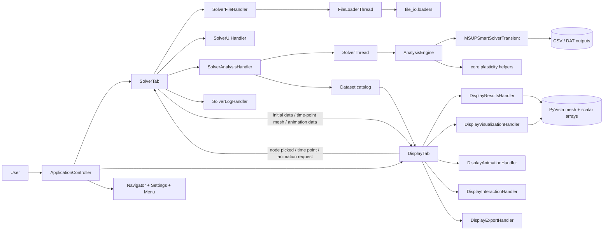
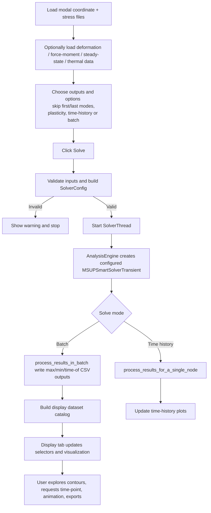
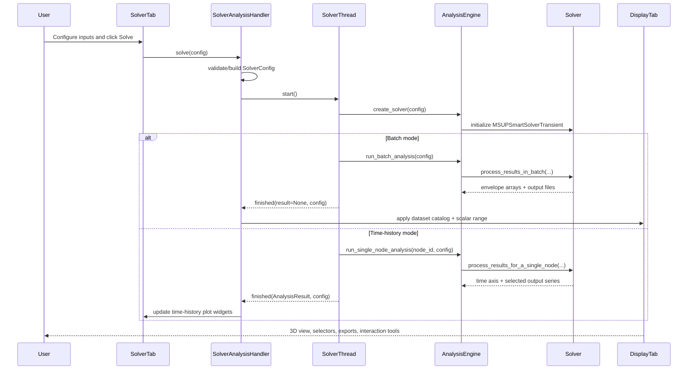

# MARS Architecture (Plain English)

## Purpose of this document
This file explains how the MARS codebase is structured and how data flows through the app at runtime.
It is designed to be a practical map for engineers making changes.

## What this app does
MARS is a desktop tool that:
- reads modal coordinate/stress data (plus optional deformation, force-moment, steady-state, and thermal/material inputs),
- computes transient response outputs using modal superposition,
- supports batch envelopes (max/min and time-of-extrema) and single-node time-history workflows,
- applies optional plasticity correction methods (Neuber, Glinka, IBG),
- visualizes results in a 3D Display tab,
- exports CSV/APDL outputs.

## Big picture
The app is split into clear parts:

- `src/ui`: windows, tabs, widgets, and handler-based UI orchestration.
- `src/core`: data models plus the `AnalysisEngine` facade and visualization-domain helpers.
- `src/solver`: heavy numerical processing (`MSUPSmartSolverTransient`, plasticity kernels).
- `src/file_io`: validators, loaders, and exporters for supported file formats.
- `src/utils`: settings, constants, file/node helpers.

Design intent:
- UI collects intent and triggers workflows.
- `AnalysisEngine` converts UI config into a configured solver run.
- Solver layer performs compute-heavy operations.
- Display handlers manage rendering, interaction, and result selection.

## Visual architecture maps
If your Markdown viewer supports Mermaid, these diagrams render inline.

Static exports are generated into `docs/architecture_diagrams/`.
To regenerate diagrams:

```bash
python3 scripts/export_architecture_diagrams.py
```

### 1) Component map (who talks to whom)


### 2) Solve pipeline (happy path)


### 3) One solve run as a sequence


## Startup flow
1. `src/main.py` loads persisted app settings and applies runtime knobs (precision, RAM %, optional software OpenGL).
2. `main.py` creates `QApplication` and instantiates `ApplicationController`.
3. `ApplicationController` creates:
- `SolverTab` for inputs + solving,
- `DisplayTab` for visualization,
- Navigator dock/menu/settings wiring.
4. Cross-tab signals are connected so solve results and display requests move both directions.

## Main runtime flow
### 1) Data loading
- `SolverFileHandler` handles file dialogs and starts `FileLoaderThread` for heavy loads.
- `file_io.loaders` parses supported inputs into dataclasses from `core.data_models`.
- `SolverTab` updates state flags and emits `initial_data_loaded` once required inputs are present.

### 2) Solve orchestration
- `SolverAnalysisHandler.solve()` validates UI state and builds `SolverConfig`.
- It launches `SolverThread` to avoid blocking the UI.
- Thread execution calls `AnalysisEngine`, which configures and runs the numerical solver.

### 3) Numerical execution
- `AnalysisEngine` slices modes (`skip_n_modes`, `skip_last_n_modes`) and maps optional datasets.
- `MSUPSmartSolverTransient` executes either:
- batch envelope runs (`process_results_in_batch`), or
- single-node time-history runs (`process_results_for_a_single_node`).
- Optional plasticity runtime context is built from material profile + temperature mapping.

### 4) Result handoff to display
- Batch flow: `SolverAnalysisHandler` builds a dataset catalog from generated outputs and pushes it to Display.
- Time-history flow: solver tab plot widgets are updated directly.
- Time-point and animation requests originate from Display tab and route back to Solver tab handler methods.

### 5) Display processing
- `DisplayResultsHandler` owns result catalog/selector behavior.
- `DisplayVisualizationHandler` manages mesh rendering, scalar range, camera/widget state.
- `DisplayInteractionHandler` handles picking, context menu tools, tracked nodes, hotspot workflows.
- `DisplayAnimationHandler` coordinates animation precomputation playback and export.

## Data contracts that keep modules decoupled
`src/core/data_models.py` defines shared dataclasses used across UI, I/O, and solver boundaries, including:
- `ModalData`, `ModalStressData`, `DeformationData`, `ElementNodalForceMomentData`,
- `SteadyStateData`, `TemperatureFieldData`, `MaterialProfileData`,
- `SolverConfig`, `PlasticityConfig`, `AnalysisResult`.

Because these contracts are centralized, UI and solver internals can evolve independently as long as model fields remain compatible.

## Key architecture rules currently enforced
1. Background work for responsiveness
- File loading and solve execution run in `QThread` wrappers.

2. Force/moment output exclusivity
- Force/moment output cannot be combined with stress/deformation/damage outputs in one run.

3. Mode skipping is first-class
- Solve config supports both leading and trailing mode skipping, validated against loaded data.

4. Plasticity guardrails
- Plasticity requires compatible selections and valid material/temperature inputs based on method.

5. Display catalog-driven selection
- Display selectors are built from a normalized result catalog instead of hard-coded widget logic.

## Folder map
- `src/main.py`: app entry and runtime settings bootstrap.
- `src/ui/application_controller.py`: top-level window, tabs, dock, menus, cross-tab wiring.
- `src/ui/solver_tab.py`: solve inputs, delegates to handler classes.
- `src/ui/display_tab.py`: 3D visualization UI and interaction endpoints.
- `src/ui/handlers/*`: isolated behaviors (file loading, state rules, solving, rendering, animation, export).
- `src/core/computation.py`: `AnalysisEngine` facade.
- `src/solver/engine.py`: core transient computation engine.
- `src/file_io/loaders.py`: parsing and input hydration into dataclasses.
- `tests/`: regression/unit coverage for data models, handlers, solver behavior, and utilities.

## Where to change what
- Add or alter solve orchestration: `src/ui/handlers/analysis_handler.py`.
- Add a new compute metric/output: `src/solver/engine.py` plus UI/config wiring.
- Change parsing logic or supported input format: `src/file_io/validators.py` and `src/file_io/loaders.py`.
- Change display selector behavior: `src/ui/handlers/display_results_handler.py`.
- Change rendering behavior: `src/ui/handlers/display_visualization_handler.py`.

## Practical summary
MARS uses a handler-driven UI with a facade-to-engine compute path.
That split keeps responsibilities clear:
- UI handles interaction and state transitions,
- `AnalysisEngine` maps config to solver execution,
- solver modules focus on numerical performance,
- display handlers focus on rendering and presentation.
